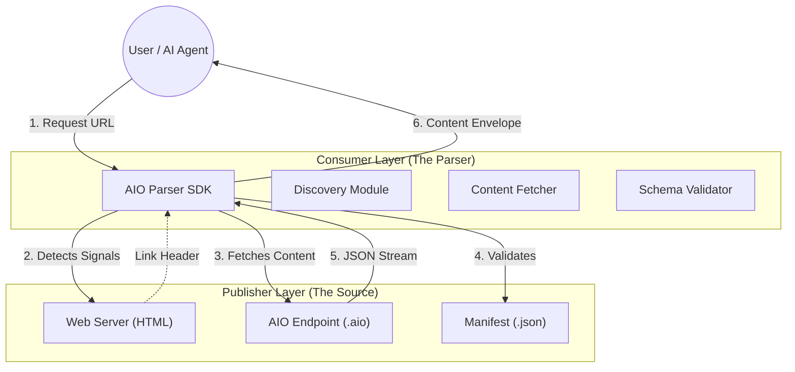

# AIO Protocol & SDK Hub

**Enterprise-Ready AI Optimization (AIO) Standard**

The AIO Protocol bridges the gap between traditional Human-Centric Web (HCW) and the emerging Machine-Centric Web (MCW). This repository provides official, certified SDKs for consuming AIO content across any stack.

---

## Architecture Overview

The AIO ecosystem operates on a dual-layer content delivery model.

---

## SDK Support Matrix

| Language | Package | Version | Use Case | Performance |
|:---|:---|:---|:---|:---|
| [`Python`](parsers/python.md) | `aio-parser` | v1.0.0 | AI Pipelines, RAG, Data Science | ⭐⭐⭐ |
| [`Node.js`](parsers/nodejs.md) | `aio-parser-js` | v1.2.0 | Request Middleware, Serverless | ⭐⭐⭐⭐ |
| [`Go`](parsers/go.md) | `aio-parser-go` | v0.9.0 | High-Scale Crawling, K8s Ops | ⭐⭐⭐⭐⭐ |
| [`Rust`](parsers/rust.md) | `aio-parser-rust` | v0.8.0 | Embedded, High-Frequency Trading | ⭐⭐⭐⭐⭐ |
| [`Java`](parsers/java.md) | `aio-parser-java` | v1.0.0 | Enterprise Backend (Spring/Jakarta) | ⭐⭐⭐⭐ |

---

## Protocol Flow

### 1. Discovery Phase
The parser attempts to locate the AIO endpoint using the **ECR Discovery Priority**:

1.  **HTTP Link Header**: `Link: </ai.aio>; rel="alternate"; type="application/aio+json"`
2.  **HTML Link Tag**: `<link rel="alternate" type="application/aio+json" href="...">`
3.  **Robots.txt**: `AIO-Content: /path/to/content.aio`
4.  **Heuristic Fallback**: `GET /ai-content.aio`

### 2. Negotiation Phase
If AIO is found:
- **Format**: JSON (Schema v2.1)
- **Encoding**: UTF-8
- **Compression**: Gzip/Brotli supported

If NOT found:
- **Fallback**: The SDK automatically downgrades to **HTML Scraping** (Cheerio/BeautifulSoup) to ensure data continuity.

---

## Security & Integrity

- **Hash Verification**: Every content chunk includes a `sha256` hash.
- **Manifest Trust**: The `ai-manifest.json` provides public keys for verifying signed content (Enterprise features).
- **Sandboxing**: Parsers are designed to be safe against large-payload attacks (Billion Laughs, ZIP bombs).

---

## Support & Contribution

- **Issues**: Please file tickets in the respective language subdirectory.
- ** RFCs**: New protocol proposals should go to `specifications/`.

&copy; 2026 AIFUSION Research. Licensed under MIT.
